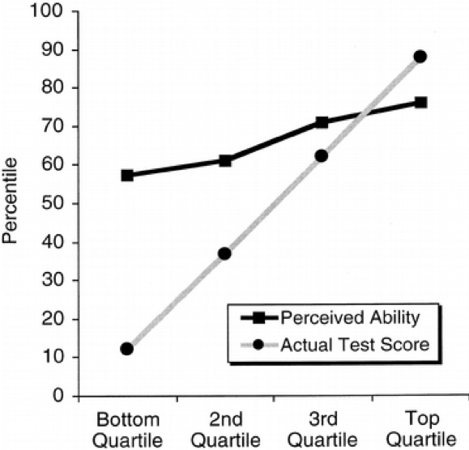

In a seminal study, @Kruger_Dunning_1999 found that:

> "participants scoring in the bottom quartile on tests of humor, grammar, and logic grossly overestimated their test performance and ability." 

The key result from this paper is illustrated by this graph, which shows a large gap between the perceived and actual skills in people from the lowest skill quartiles. 

```{r, echo=FALSE, out.width="50%"}

```
In a [recent article from McGill University's Office for Science and Society](https://www.mcgill.ca/oss/article/critical-thinking/dunning-kruger-effect-probably-not-real), Jonathan Jarry reports on simulations conducted by Patrick McKnight purporting to show that the Dunning-Kruger effect could be an artefact of noisy data. 

The simulation was apparently done in `R`, but the (popular press) article included too little detail for my taste, so this is my attempt at a replication.

We will make four assumptions about the relationship between actual and perceived skills:

1. The more actual skills you have, the higher your perceived skills.
2. The more actual skills you have, the less error you make when assessing your own (perceived) skills.
3. Measurement error is symmetric; everyone is as likely to underestimate as to overestimate their own actual skills, regardless of skill level.
4. We do *not* assume that actual skills or perceived skills are bounded, in order to distinguish the phenomenon under study from pure ceiling/floor effects.^[In conclusion, we'll see that using quartiles to draw the plot re-introduces a kind of ceiling/floor effect.]

To begin, we load the `data.table` library, define the sample size, and create a convenience function to assign quantile labels.

```{r}
library(data.table)

set.seed(1024)

# utility function to assign quantile labels
get_quantiles = function(x, ngroups) {
  cut(x, quantile(x, probs=seq(0, 1, length.out=ngroups+1)), 
      include.lowest=TRUE, labels=FALSE)
}
```

Then, we simulate 1000 data points and plot them:

```{r, fig.asp=.7}
N = 1000
Skill = rnorm(N)
groups = get_quantiles(Skill, 50)
Perception = rnorm(N, 
                    mean = Skill,                   
                    sd = .3 * (max(groups)-groups+3))

plot(Skill, Perception, 
     main = sprintf("Correlation between actual and perceived skills: %s", 
                    round(cor(Skill, Perception), 2)))
```

Using these data, we compute group averages:

```{r}
cols = c("Skill", "Perception")
dat = data.table(Skill, Perception)                         [
  , x := get_quantiles(Skill, 4)                            ][
  , (cols) := lapply(.SD, get_quantiles, 100), .SDcols=cols ][
  , lapply(.SD, mean), by = .(x)                            ][
  order(x)                                                  ]
```

Finally, we plot the results:

```{r, fig.asp=.7}
plot(
  x    = dat$x,
  y    = dat$Skill,
  type = "b",
  xaxt = "n",
  xlab = "Skill",
  ylab = "Percentiles")
lines(
  x    = dat$x,
  y    = dat$Perception,
  type = "b",
  col  = "red")
axis(1, at=c(1, 2, 3, 4), labels=c("Q1", "Q2", "Q3", "Q4"), las=1) 
text(3, 70, labels="Actual")
text(3.5, 58, labels="Perceived", col="red")
```

### Conclusion

The Dunning-Kruger could potentially be explained by the fact that high-skill people make smaller errors in self-assessment. This explanation could hold even if self-assesment errors are symmetric, that is, even if everyone is as likely to overestimate or underestimate their own skills.

One piece of the intuition behind this weird result is that even if people in the bottom quartile are as likely to underestimate as they are to overestimate their skill level in absolute terms, they *cannot* underestimate their relative position in the quartile ranks. They can either be right or overestimate it. Likewise, people at the very top of the actual skill distribution cannot overestimate their rank. Accordingly, the graph shows that low-rank people overestimate whereas high rank people underestimate.
