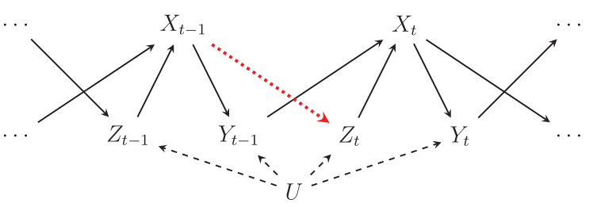
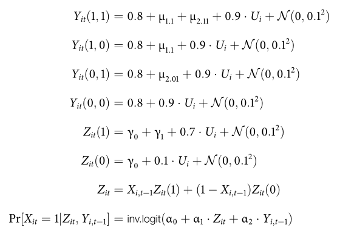
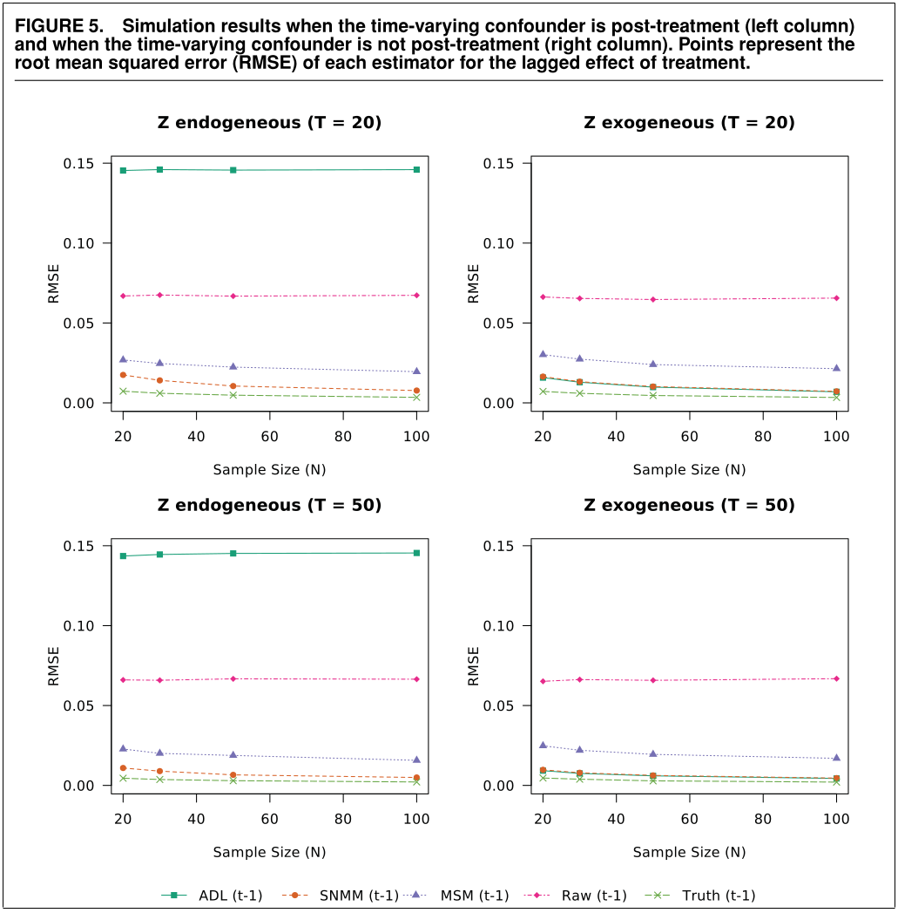

Andrew Heiss recently published a series of [cool blog posts](https://www.andrewheiss.com/blog/2020/12/03/ipw-tscs-msm/)  about his [exploration of inverse probability weights for marginal structural models (MSM)](https://www.andrewheiss.com/blog/2021/01/15/msm-gee-multilevel/). Inspired by his work, I decided to look into this a bit too. This notebook has four objectives:

1. Replicate the simulation from an article by @BlaGly2018 who advocate the use of MSM for causal inference with panel data.
2. Extend their simulation by adding a simple fixed effects model.
3. Provide well-annotated code for readers who may want to estimate their own MSMs.
4. Illustrate an easy way to run simulations in parallel using `R`'s `mcMap` function.

This image is taken from @BlaGly2018 and describes the data generating process that the authors consider in their simulations:

```{r, echo=FALSE, out.width="85%", fig.align="c"}

```

In this DAG, $Y$ is the dependent variable, $X$ is the explanator, $Z$ is a time-varying confounder, and $U$ is a time-invariant unit-specific and unmeasured confounder. 

Our goal is to estimate two quantities: (1) the lagged effect of $X_{t-1}$ on $Y_t$, and (2) the contemporaneous effect of $X_t$ on $Y_t$. The DAG shows that the former should be zero: there are no arrows from $X_{t-1}$ to $Y_t$, except through $X_t$.

As @BlaGly2018 point out, in order to estimate the effect of $X_t$ on $Y_t$, we must adjust for $Z_t$, otherwise $U$ will confound the results (there is a backdoor path through $U$). Unfortunately, when there is a relationship between $X_{t-1}$ and $Z_t$ (the red dotted arrow), adjusting for $Z_t$ also introduces a bias because $Z_t$ is post-treatment with respect to $X_{t-1}$. As a result, the standard autoregressive distributed lag model (ADL) will often produce bad results.

The solution recommended by @BlaGly2018 is to use a Marginal Structural Model (MSM) or a Structural Nested Mean Model (SNMM). The authors do a good job of describing both approaches, and interested readers should refer to the article for background. But roughly speaking, the MSM approach involves estimating a weighted regression model of $Y_t$ on $X_t$ and $X_{t-1}$, with weights defined as:

$$
w_{it} = \prod_{t=1}^t \frac{
  P(X_{it}|X_{it-1})}{
  P(X_{it}|X_{it-1}, Z_{it}, Y_{it-1})}
$$

The SNMM approach involves estimating an auxiliary model, using that model to transform the dependent variable, and then estimating the final SNMM model (see pp.7-9 or the code below). 

To organize our simulation, we will use three functions:

1. `sim`: a function to simulate data that conform to the DAG.
2. `fit`: a function that estimates 5 models and returns the estimated effect of $X_{t-1}$ for each model in a named list.
3. `montecarlo`: a wrapper function that calls both `sim` and `fit`.

This setup will allow us to run simulations in parallel for many replications and many different data generating processes.

We will use only two packages for this:

```{r, echo=TRUE}
library(data.table)
library(ggplot2)
```

# Data simulation

The data generating process follows these rules:^[This is a screenshot from the supplementary materials available at DataVerse.]

```{r, echo=FALSE, out.width="70%", fig.align="center"}

```

```{r, echo=TRUE, out.width="100%", fig.align="c"}
sim = function(
  N       = 10,     # number of units
  T       = 10,     # number of time periods
  gamma   = -0.5) { # effect of X on Z

  # hardcoded values from Blackwell and Glynn's replication file
  mu_1_1   = 0               # effect of X_l1 on Y
  mu_2_01  = -0.1            # effect of X on Y
  mu_2_11  = -0.1            # effect of X * X_l1 on Y
  alpha1 = c(-0.23, 2.5)     # initial value of X
  alpha2 = c(-1.3, 2.5, 1.5) # subsequent values of X

  # store panel data as a bunch of NxT matrices
  Y = X = Z = matrix(NA_real_, nrow = N, ncol = T)

  # time invariant unit effects
  U = rnorm(N, sd = .1)
  eps1 = .8 + .9 * U

  # first time period of each unit
  Y_00 = eps1 + rnorm(N, sd = .1)
  Y_01 = eps1 + mu_2_01 + rnorm(N, sd = .1)
  Y_10 = Y_11 = Y_00
  Z[, 1] = 1.7 * U + rnorm(N, .4, .1)
  X_p = boot::inv.logit(alpha1[1] + alpha1[2] * Z)
  X[, 1] = rbinom(N, 1, prob = X_p)
  Y[, 1] = Y_01 * X[, 1] + Y_00 * (1 - X[, 1])

  # recursive data generating process
  for (i in 2:T) {

    # potential outcomes
    Y_11 = eps1 + mu_1_1 + mu_2_11 + rnorm(N, sd = .1)
    Y_10 = eps1 + mu_1_1 + rnorm(N, sd = .1)
    Y_01 = eps1 + mu_2_01 + rnorm(N, sd = .1)
    Y_00 = eps1 + rnorm(N, sd = .1)

    # potential confounders
    Z_1 = 1 * gamma + 0.5 + 0.7 * U + rnorm(N, sd = .1)
    Z_0 = 0 * gamma + 0.5 + 0.7 * U + rnorm(N, sd = .1)
    Z[, i] = X[, i - 1] * Z_1 + (1 - X[, i - 1]) * Z_0
    
    # treatment
    X_pr = alpha2[1] + alpha2[2] * Z[, i] + alpha2[3] * Y[, i - 1] + rnorm(N)
    X[, i] = 1 * (X_pr > 0)

    # outcome
    Y[, i] = # control
             Y_00 +
             # effect of lagged X
             X[, i - 1] * (Y_10 - Y_00) +
             # effect of contemporaneous X
             X[, i] * (Y_01 - Y_00) + 
             # effect of both (TODO: why is it "-"?)
             X[, i - 1] * X[, i] * ((Y_11 - Y_01) - (Y_10 - Y_00)) 
  }

  # reshape and combine matrices
  out = list(X, Y, Z)
  for (i in 1:3) {
    out[[i]] = as.data.table(out[[i]])
    out[[i]][, unit := 1:.N]
    out[[i]] = melt(out[[i]], id.vars = "unit", variable.name = "time")
    out[[i]] = out[[i]][, time := as.numeric(gsub("V", "", time))]
  }
  colnames(out[[1]])[3] = "X"
  colnames(out[[2]])[3] = "Y"
  colnames(out[[3]])[3] = "Z"
  out = Reduce(function(x, y) merge(x, y, by = c("unit", "time")), out)

  # lags
  out[, `:=` (
    Y_l1 = shift(Y),
    Y_l2 = shift(Y, 2),
    X_l1 = shift(X),
    Z_l1 = shift(Z))]

  return(out)

}
```

# Fit function

We estimate five different models. Four of them were already reported in the original paper. The last is a simple fixed effects model with a dummy variable for each unit. In principle, adjusting for unit fixed effects should close the backdoor through $U$ and reduce bias.

```{r, echo=TRUE}
fit = function(dat) {

  results = list()

  # 1. ADL (t-1)
  pols = lm(Y ~ X + X_l1 + Y_l1 + Y_l2 + Z + Z_l1, data = dat)
  co = coef(pols)
  results[["ADL (t-1)"]] = co["X_l1"] + co["Y_l1"] * co["X"]

  # 2. SNMM (t-1)
  dat$Ytil = dat$Y - dat$X * coef(pols)["X"]
  pols2 = lm(Ytil ~ Y_l2 + X_l1 + Z_l1, data = dat) 
  results[["SNMM (t-1)"]] = coef(pols2)["X_l1"]

  # 3. MSM (t-1)
  ps.mod = glm(X ~ Y_l1 + Z + X_l1, data = dat, 
               na.action = na.exclude, family = binomial())
  num.mod = glm(X ~ X_l1, data = dat, 
                na.action = na.exclude, family = binomial())
  pscores = fitted(ps.mod) * dat$X + (1 - fitted(ps.mod)) * (1 - dat$X)
  nscores = fitted(num.mod) * dat$X + (1 - fitted(num.mod)) * (1 - dat$X)
  dat[, ws := nscores / pscores][
      , cws := cumprod(ws), by = unit]
  msm = lm(Y ~ X + X_l1, data = dat, weights = cws)
  results[["MSM (t-1)"]] = coef(msm)["X_l1"]

  # 4. Raw (t-1)
  mod.raw = lm(Y ~ X + X_l1, data = dat)
  results[["Raw (t-1)"]] = coef(mod.raw)["X_l1"]

  # Extension: Fixed effects
  mod.fe = lm(Y ~ X + X_l1 + factor(unit), data = dat, warn = FALSE)
  results[["FE (t-1)"]] = coef(mod.fe)["X_l1"]

  return(results)

}
```

# Run the simulation

First, we use a `data.frame` store the parameter values that we want to use for generating data. The `ID` column creates an identifier for the 100 replications of the simulation experiment. If we wanted to run the experiment 5000 times, we would simply change that variable. `expand.grid` create a `data.frame` with all the possible combinations of the supplied arguments:

```{r, echo=TRUE}
# simulation parameters
params <- expand.grid(
  ID = 1:100,
  N = c(20, 30, 50, 100),
  T = c(20, 50),
  gamma = c(0, -.5))

head(params)
```

Then we define a wrapper function to do all the steps for us and record the DGP parameters for each simulation:

```{r, echo=TRUE}
montecarlo = function(N, T, gamma) {
  dat = sim(N = N, T = T, gamma = gamma)
  res = fit(dat)
  res[["N"]] = N
  res[["T"]] = T
  res[["gamma"]] = ifelse(gamma == 0, 
                          "Z exogenous", 
                          "Z endogenous")
  res
}
```

Finally, we use the `mcMap` function from the `parallel` package (part of base `R`) to run the simulation using 8 cores:

```{r, echo=TRUE}
results = parallel::mcMap(
  montecarlo, 
  N = params$N, 
  T = params$T, 
  gamma = params$gamma, 
  mc.cores = 8)

# combine and reshape results
results = rbindlist(results)

results = melt(
  results, 
  id.vars = c("N", "T", "gamma"), 
  variable.name = "Model")

# calculate RMSE
truth = 0
results = results[
  , .(rmse = sqrt(mean((value - truth)^2))), by = .(N, T, gamma, Model)][
  , T := paste("T =", T)]
```

# Results

When we plot the results, we find that our simulation results come very close to those in the original article. Success!

Also, as expected, the fixed effects model seems to perform well.

```{r, echo=TRUE, fig.cap="New simulation results."}
# plot results
ggplot(results, aes(N, rmse, color = Model)) +
  geom_line() +
  geom_point() +
  facet_grid(T ~ gamma, scales = "free") + 
  theme_classic() +
  labs(y = "RMSE", x = "Number of units") +
  scale_y_continuous(breaks = c(0, .05, .1, .15), limits = c(0, .15)) +
  scale_color_manual(values = c("#CC6677", "#332288", "#DDCC77", "#117733",
                                "#88CCEE", "#882255", "#44AA99", "#999933",
                                "#AA4499", "#DDDDDD"))
```

```{r, echo=FALSE, out.width="100%", fig.align="c", fig.cap="Original simulation reported by Blackwell and Glynn (2018)"}

```
